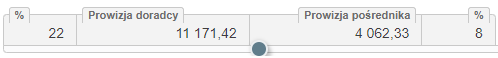

# DOCUMENT ATTRIBUTES

## Features field
type: JSONField; JSON dictionary field {}
### Properties
```json
"calculable": {"sources":[], "calcFunc": "()=>{}"}
```
```json
"actions": {
             "change": {"fn": "()=>{}" [, "triggerOnStartup": true|false ]}
             "...":
           }
```
## Lov field
"select" input type option definition.
Defined in the DocumenTypeAttribute.lov  field
### Structure
```json
{"data": [{"lov_label": "some label", "lov_value": "some value", "description": "some desc"}, {...}], "nullvalue": true|false}
```

## Schedule section example
```json
{
	"mapping": {
		"value": "3289",
		"startDate": "3283",
		"capitalNet": "3293",
		"commission": "3295",
		"gracePeriod": "3308",
		"instalmentNumber": "3275",
		"debtCollectionFee": "3308",
		"debtorBankAccount": "3285",
		"instalmentCapital": "3326",
		"instalmentCommission": "3273",
		"interestForDelayRate": "3266",
		"interestForDelayType": "3264",
		"instalmentInterestRate": "3262",
		"debtCollectionFeePeriod": "3308"
	},
	"toolbar": {
		"buttons": [
			{
				"fn": "()=>{window.financePack.schedule.Schedule.generate(true)}",
				"icon": "fa fa-undo",
				"name": "recreateBtn",
				"title": "Wygeneruj harmonogram",
				"selector": "schedule-recreate-btn"
			}
		]
	},
	"readonly": true,
	"container": {
		"style": "max-height: calc(100% - 350px); overflow: auto;"
	},
	"repeatable": true,
	"panelHeading": {
		"style": ""
	},
	"rowNumbering": true
}
```
## Balance control
the example of defining balance control

```json
{
  "balance": {
    "step": 1,
    "leftName": "Left field title",
    "leftRange": 0,
    "rightName": "Right field title",
    "rightRange": 30,
    "referenceInput": 3380
  }
}
```

# EVENTS
## documentAttributeEvt
